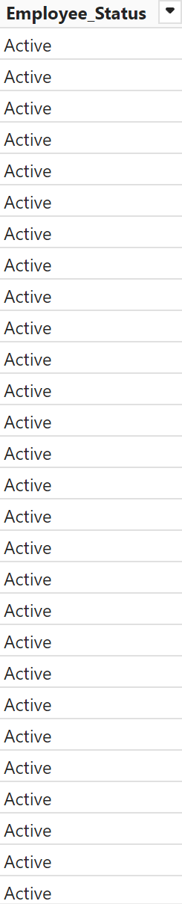

# Employee Management

## Introduction
The project showcases an interactive Power BI dashboard designed to analyze and visualize key employee management metrics. The dashboard highlights insights into workforce performance, productivity, remote work, overtime hours, and salary classifications. The purpose is to help organizations understand employee behavior, productivity trends, and factors contributing to overall satisfaction and retention.

## Problem Statement
The task is to design and build an interactive Power BI report that provides clear, actionable insights for HR and management teams. The report should focus on one or more of the following key areas:

- Performance evaluation
- Productivity metrics
- Job satisfaction trends
- Churn and retention 

## Skills Demonstrated
- Data Cleaning and Transformation
- Data Analysis & Visualization (Power BI)
- Interactive dashboard design
- Drill-down and filter implementation for dynamic exploration
- DAX (Data Analysis Expressions) for complex calculations
- Implement UI/UX
- Next Level KPI

## Data Sourcing
The dataset used in this project is provided as part of the Onyx Data October 2024 Challenge.The dataset includes anonymized employee management data with key details such as job satisfaction scores, productivity metrics, overtime hours, training hours, team size, salary classifications, remote work frequency, project volume, turnover rates, and promotion status. This data is leveraged to provide insights on workforce performance, productivity, and retention trends.

More Information About This Challenge: [Onyx Data October 2024 Challenge](https://zoomcharts.com/en/microsoft-power-bi-custom-visuals/challenges/onyx-data-october-2024)

## Data Transformation
Data transformation involved the following steps:
1. **Data Cleaning**: Removing duplicates, handling missing values, and correcting inconsistencies.
2. **Data Aggregation**: Summarizing data by month, sales agent, industry, and country.
3. **Feature Engineering**: Creating new features such as month-over-month changes, response times, and sales cycle duration.

## Modeling
The project involved creating various models to derive insights:
1. **Descriptive Models**: To understand current and historical sales performance.
2. **Predictive Models**: Using historical data to forecast future sales trends and potential income.
3. **Diagnostic Models**: Analyzing factors influencing sales performance, conversion rates, and deal values.

In this project, I created a calendar table to facilitate time-based analysis. The calendar table contains information about dates, months, years, quarters, and more, which allows for better data analysis based on time dimensions. The calendar table is also used to create time relationships in the data model.

| DAX | Result |
|----------|----------|
|  |  |
|  |  |
|  |  |
|  |  |
|  |  |
|  |  |
|  |  |

And Create Relationship between Date Table and Fact Table

Various DAX measures were used to calculate time-based metrics and other analyses. These measures helped in analyzing trends and identifying patterns in the CRM data. Some of the key DAX measures include:

KPI Card

Detailed KPI

Reference KPI

Accuracy

## Analyze & Visualization
The analysis and visualization were done using Power BI to create an interactive dashboard. Key visualizations include:

- Employee Turnover and Retention Rates
- Job Satisfaction Distribution by Salary and Overtime
- Employee Performance Trends Across Remote Work Frequency
- Overtime and Satisfaction Analysis by Gender and Job Title
- Promotion Distribution and Gender Drilldowns
- Project Load by Salary Classification and Team Size
- Sick Leave Patterns and Impact on Productivity
- Salary Classification’s Relationship with Satisfaction
- Team Size Impact on Productivity Metrics
- Non-linear Trends in Overtime Hours and Satisfaction Levels
- Training Hours Impact on Performance Scores

### In this project there are 2 pages :
- Performance
- Productivity

You can interact with report here [FP20 Analytics Challenge 15 Dashboard](https://zoomcharts.com/en/microsoft-power-bi-custom-visuals/challenges/submission/5204e2eca27ba518bba8b95278284ef1?challenge=fp20-analytics-july-2024)

## Conclusion
The analysis provided several key insights:
- **Turnover and Retention**: The turnover rate of 10.01% is healthy, with the “Other” gender having the lowest turnover (9.75%). The retention rate is strong at 89.99%, showing that most employees stay long-term.
- **Overtime Patterns**: Average weekly overtime hours are highest among male and “Other” employees at 14.49 and 14.46 hours, with females slightly lower at 14.54 hours. Notably, “Other” employees work an average of 45 hours per week, higher than other genders.
- **Promotions**: The promotion distribution is balanced, with approximately 33.27K employees promoted more than once, and 33.30K not promoted.
- **Satisfaction and Salary**: Employees with higher salaries, especially those earning over 6K, report higher satisfaction, indicating a positive relationship between salary and satisfaction.
- **Sick Leave**:  Among employees, 46.79% took more than 7 sick days, while 46.50% took fewer. This balance shows an active workforce.
- **Project Load by Salary**: Higher-salaried employees, particularly those in the 7K-9K range, handle more projects than other salary bands.
- **Training and Performance**: Performance scores tend to decrease as training hours increase beyond 49.60, suggesting the training may lack effectiveness. Optimal performance aligns with a training range of 49.00-49.20 hours.
- **Remote Work and Performance**: Performance is generally stable with remote work frequency but slightly dips beyond 50%. Flexibility from remote work has benefits, but excessive frequency might hinder productivity.
- **Overtime and Satisfaction**: Satisfaction declines as overtime hours surpass 14.50 weekly hours, indicating that excessive overtime negatively impacts morale, crossing a threshold after which satisfaction decreases.
- **Team Size and Productivity**: Smaller teams (1-5 members) achieve higher productivity (643.26K projects) compared to larger teams (16-19 members) with 521.10K projects, suggesting productivity may decrease in larger teams.
- **Turnover by Role and Age**: The turnover rate is relatively consistent (~10%) across job titles, with an increase in the 50-60 age group.
- **Project Volume Over Time**: Project volume has been stable from 2015 to 2022 (~240K projects), with a notable drop in 2024 (~160K). Remote work remains dominant over in-office work.
- **Overtime by Day:**:  Higher average overtime hours are more common at the beginning of the week, especially on Mondays.

